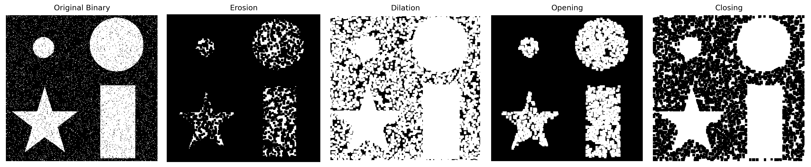
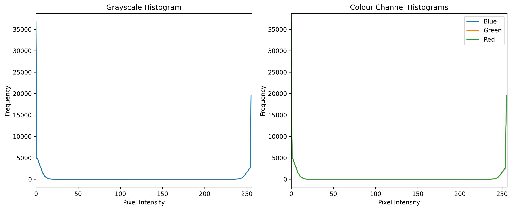
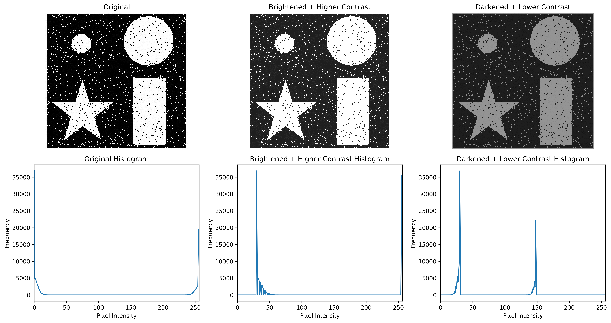
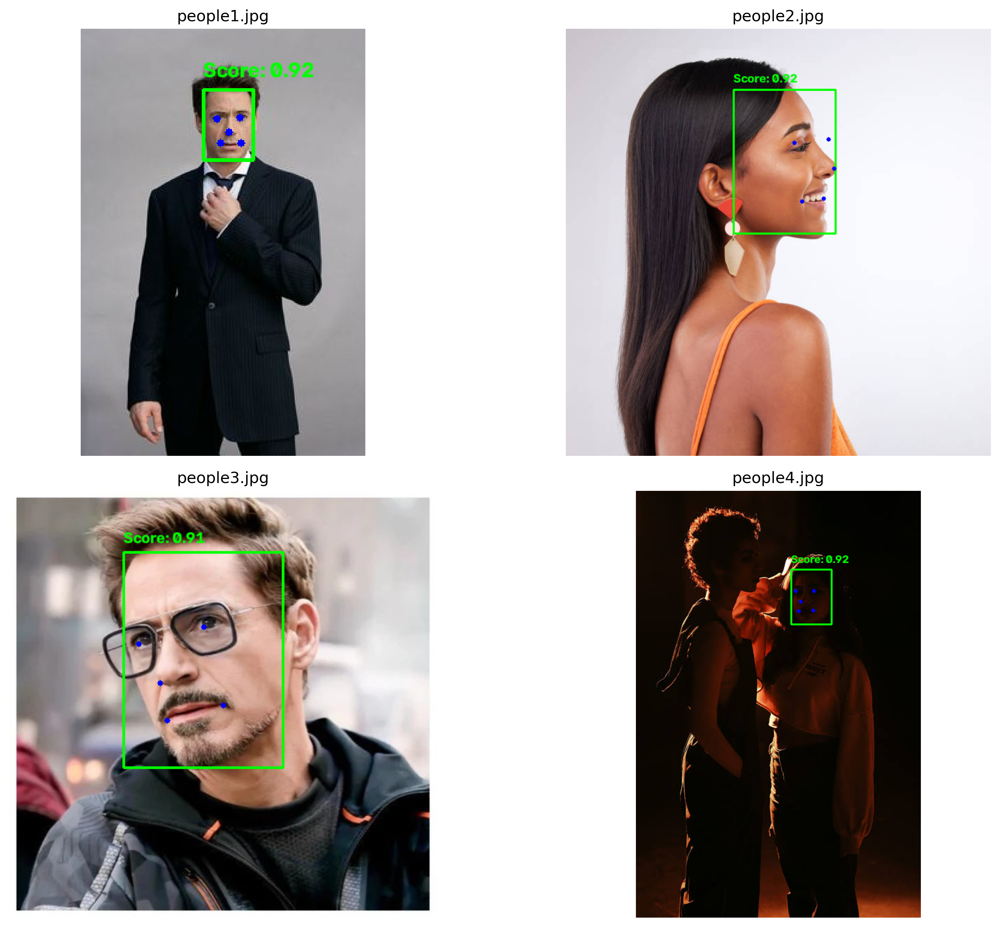
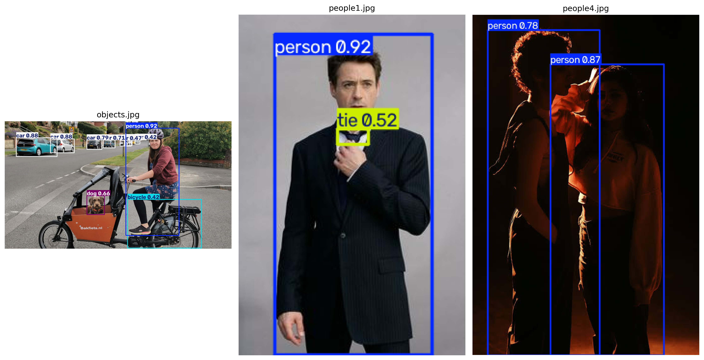
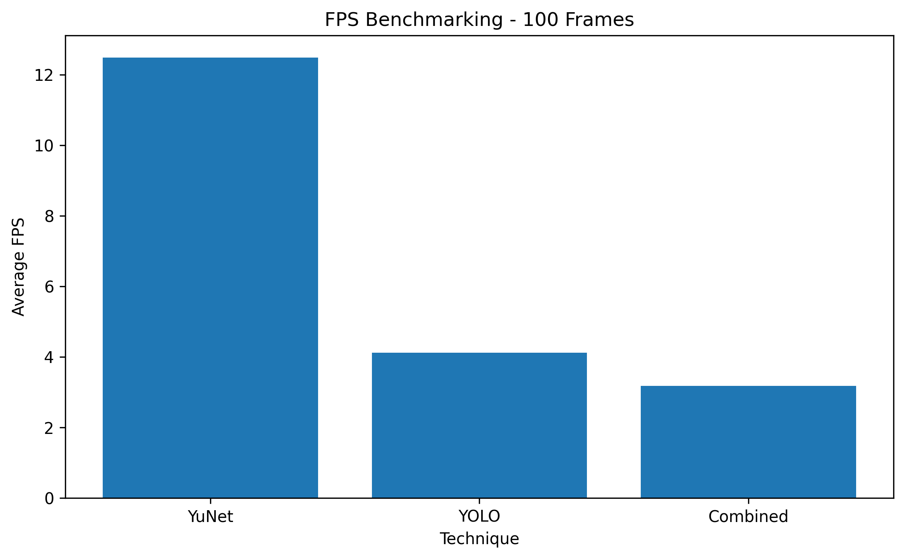

# 🧠 Computer Vision Pipeline using OpenCV, YuNet & YOLOv8


---

## 📑 Table of Contents

-   [📌 Project Overview](#-project-overview)
-   [🎯 Project Objectives](#-project-objectives)
-   [📂 Data & Model Sources](#-data--model-sources)
-   [🧠 Computer Vision Topics
    Covered](#-computer-vision-topics-covered)
-   [📊 Key Visualizations](#-key-visualizations)
-   [📈 Results Comparison](#-results-comparison)
-   [🏆 Key Findings](#-key-findings)
-   [🛠️ Tools & Technologies](#️-tools--technologies)
-   [🚀 Installation & Usage](#-installation--usage)
-   [📁 Project Structure](#-project-structure)
-   [🎥 Project Demonstration Video](#-project-demonstration-video)
-   [📂 Repository Navigation](#-repository-navigation)
-   [📦 Requirements](#-requirements)
-   [👨‍💻 Author](#-author)

---

# 📌 Project Overview

This project builds a practical **Computer Vision Pipeline** using both
classical image-processing techniques and deep-learning-based detectors.

The pipeline progressively covers **morphological operations, bitwise
operations, image histograms, YuNet face detection, and YOLOv8 object
detection**, followed by an integrated real-time webcam pipeline.

The project also compares detection thresholds, privacy blurring,
preprocessing effects, and the real-time FPS of **YuNet, YOLOv8n, and
the combined pipeline**.

---

# 🎯 Project Objectives

This project aims to:

-   Perform grayscale conversion and binary thresholding using OpenCV.
-   Apply **erosion, dilation, opening, and closing** morphological
    operations.
-   Compare different morphological **kernel shapes and sizes**.
-   Demonstrate **AND, OR, XOR, and NOT** bitwise operations using
    binary masks.
-   Apply masking and watermarking to a real image.
-   Analyze grayscale and per-channel colour histograms.
-   Study brightness and contrast adjustment using `alpha` and `beta`.
-   Detect faces using the **YuNet** face detection model.
-   Display YuNet bounding boxes, confidence scores, and five facial
    landmarks.
-   Perform real-time YuNet face detection using a webcam.
-   Compare YuNet score thresholds and demonstrate privacy-preserving
    face blurring.
-   Detect multiple COCO-class objects using **YOLOv8n**.
-   Perform real-time YOLO object detection and measure FPS.
-   Study confidence and IoU threshold effects and demonstrate **NMS
    duplicate-box suppression**.
-   Summarize YOLO detections by class.
-   Build an integrated **YuNet + YOLOv8n** real-time pipeline.
-   Benchmark YuNet, YOLOv8n, and the combined pipeline using 100 webcam
    frames.

---

# 📂 Data & Model Sources

## 🖼️ Image Sources

The project uses:

-   **OpenCV sample images** for computer-vision experiments.
-   **Personal/phone photographs** for testing face and object
    detection.

OpenCV sample-data repository:\
https://github.com/opencv/opencv/tree/4.x/samples/data

Personal/phone photographs are user-provided test images and therefore
do not have an external public source.

## 🤖 Model Sources

### YuNet Face Detector

Model file:

`data/models/face_detection_yunet_2023mar.onnx`

Source:\
https://github.com/opencv/opencv_zoo/tree/main/models/face_detection_yunet

### YOLOv8n Object Detector

Model file:

`yolov8n.pt`

Source:\
https://github.com/ultralytics/ultralytics

YOLOv8 documentation:\
https://docs.ultralytics.com/models/yolov8/

---

## 🧠 Computer Vision Topics Covered

| **Topic** | **Description** |
|---|---|
| **1️⃣ Image Processing & Morphology** | Performs grayscale conversion, binary thresholding, and the four morphological operations using different kernel shapes and sizes. |
| **2️⃣ Bitwise Operations & Histograms** | Demonstrates mask-based AND/OR/XOR/NOT operations and analyses grayscale, colour, brightness, and contrast distributions. |
| **3️⃣ Face Detection with YuNet** | Uses YuNet for static and real-time face detection with bounding boxes, five landmarks, confidence thresholds, and privacy blurring. |
| **4️⃣ Object Detection with YOLOv8** | Detects multiple COCO objects in images and webcam frames, compares confidence/IoU thresholds, and demonstrates NMS duplicate suppression. |
| **5️⃣ Integrated Pipeline & Comparison** | Combines YuNet and YOLOv8n in a real-time pipeline, tests morphological pre-cleaning, benchmarks FPS, and compares the overall approaches. |

---

# 📊 Key Visualizations

Only the main project visuals are shown here. The repository `plots/` folder contains the complete set of generated plots.

## 🧱 1. Morphological Operations



**💡 Caption:** The four morphological operations—erosion, dilation, opening, and closing—show how different filters change foreground regions and help reduce noise or fill gaps.

---

## 📊 2. Histogram & Brightness/Contrast Analysis





**💡 Caption:** Histograms show grayscale and colour-channel intensity distributions, while brightness and contrast adjustments demonstrate how pixel values change.

---

## 🙂 3. YuNet Face Detection



**💡 Caption:** YuNet detects faces and displays bounding boxes, confidence scores, and five facial landmarks across the selected test images.

---

## 🤖 4. YOLOv8 Object Detection



**💡 Caption:** YOLOv8n detects multiple COCO-class objects, including people, cars, bicycles, and dogs, in the selected test images.

---

## ⚡ 5. Real-Time FPS Comparison



**💡 Caption:** The benchmark compares real-time performance of YuNet, YOLOv8n, and the combined YuNet + YOLOv8n pipeline over 100 webcam frames.

---

## 📈 Results Comparison

The table below summarizes the final comparison from the integrated pipeline.

| **Technique** | **Type** | **What It Detects** | **Lighting Robustness** | **Approx. FPS** | **Best Use Case** |
|---|---|---|---|---:|---|
| Morphological Operations | Classical | Noise, shapes, small gaps | Low–Medium | N/A | Image preprocessing and denoising |
| Bitwise Operations | Classical | Masked regions / ROIs | Low | N/A | Masking and region extraction |
| Histograms | Classical | Pixel intensity and colour distribution | Medium | N/A | Brightness, contrast and image analysis |
| YuNet Face Detection | Deep Learning | Human faces | High | **12.48** | Real-time face detection |
| YOLOv8n Object Detection | Deep Learning | 80 COCO object classes | High | **4.11** | Multi-class object detection |
| Combined YuNet + YOLO | Deep Learning | Faces + objects | High | **3.18** | Integrated real-time CV pipeline |

### Interpretation

-   Classical techniques are mainly useful for image preprocessing and
    image analysis.
-   **YuNet** achieved the highest measured FPS at **12.48**.
-   **YOLOv8n** achieved **4.11 FPS** while providing multi-class object
    detection.
-   The **combined pipeline** achieved **3.18 FPS** because both
    detectors run on every frame.
-   The results demonstrate the trade-off between detection capability
    and computational cost.

---

# 🏆 Key Findings

### 🧱 Morphological Processing

The experiments showed that erosion, dilation, opening, and closing have
different effects on foreground regions. Among the tested kernel
configurations, the **CROSS 5×5 kernel** gave the best balance for the
selected image by reducing noise while preserving object outlines.

### 🎯 YuNet Face Detection

YuNet successfully detected faces across different poses and lighting
conditions and returned **five facial landmarks** with each detection.

The dark-lighting test showed that challenging illumination can cause
missed detections. The tested score thresholds of **0.5, 0.7, and 0.9**
produced the same face count on the selected image.

### 🤖 YOLOv8 Object Detection

YOLOv8n successfully detected multiple COCO classes in static images and
operated in real time through the webcam.

For confidence threshold tuning, the number of detected boxes decreased
from **10 at 0.25** to **6 at 0.50** and **4 at 0.75**. The NMS
experiment also demonstrated how IoU controls suppression of overlapping
detections.

### 📋 Per-Class Detection

Across the selected test images:

-   **Car:** 8 detections
-   **Person:** 7 detections
-   **Dog:** 1 detection
-   **Bicycle:** 1 detection
-   **Tie:** 1 detection

A specific missed-detection example was observed in `people1.jpg`, where
multiple people are visible but YOLOv8 detects only two people.

### ⚡ Real-Time Performance

The final 100-frame benchmark showed:

-   **YuNet:** 12.48 FPS
-   **YOLOv8n:** 4.11 FPS
-   **Combined YuNet + YOLO:** 3.18 FPS

This demonstrates that combining multiple detectors increases
computational cost and reduces real-time speed.

---

## 🛠️ Tools & Technologies

| **Category** | **Technologies** |
|---|---|
| **Programming Language** | Python 3.13 |
| **Computer Vision** | OpenCV 5.0.0 |
| **Deep Learning / Detection** | YuNet, Ultralytics YOLOv8n |
| **Numerical Computing** | NumPy 2.3.3 |
| **Data Visualization** | Matplotlib 3.10.7 |
| **Development Environment** | Jupyter Notebook, VS Code |
| **Version Control** | Git & GitHub |

---

# 🚀 Installation & Usage

### 1️⃣ Clone the Repository

``` bash
git clone https://github.com/PareeSojitra0803/Computer_Vision_Pipeline_Deep_Learning.git
```

### 2️⃣ Navigate to the Project Directory

``` bash
cd Computer_Vision_Pipeline_Deep_Learning
```

### 3️⃣ Install the Required Dependencies

``` bash
pip install -r requirements.txt
```

### 4️⃣ Launch Jupyter Notebook

``` bash
jupyter notebook
```

### 5️⃣ Open the Notebook

``` text
CV_PR3.ipynb
```

Run the notebook cells sequentially from top to bottom.

> **Note:** Webcam-based sections require access to a working camera.
> Press **Q** to exit the real-time detection windows.

---

# 📁 Project Structure

``` text
Computer_Vision_Pipeline_Deep_Learning/
│
├── data/
│   ├── images/
│   │   ├── bitwise.png
│   │   ├── morphology.jpg
│   │   ├── objects.jpg
│   │   ├── people1.jpg
│   │   ├── people2.jpg
│   │   ├── people3.jpg
│   │   └── people4.jpg
│   │
│   └── models/
│       └── face_detection_yunet_2023mar.onnx
│
├── plots/
│   ├── binary_threshold.png
│   ├── morphology_operations.png
│   ├── morphology_grid.png
│   ├── bitwise_operations.png
│   ├── masked_overlay.png
│   ├── histogram_comparison.png
│   ├── brightness_contrast.png
│   ├── face_detection_comparison.png
│   ├── privacy_blur.png
│   ├── yolo_detections.png
│   ├── threshold_comparison.png
│   ├── iou_comparison.png
│   ├── nms_before_after_comparison.png
│   ├── per_class_detection_summary.png
│   ├── morphological_precleaning.png
│   └── fps_comparison.png
│
├── CV_PR3.ipynb
├── CV_PR3.html
├── requirements.txt
└── README.md
```


---

# 🎥 Project Demonstration Video

A complete walkthrough of the project, including classical image
processing, YuNet face detection, YOLOv8 object detection, the
integrated pipeline, and FPS benchmarking, should be linked below.

### 🎬 Project Explanation Video

> **Video Link:**\
> **\[ADD YOUR PROJECT VIDEO LINK HERE\]**

---

## 📂 Repository Navigation

| **File / Folder** | **Description** |
|---|---|
| 📓 [CV_PR3.ipynb](CV_PR3.ipynb) | Complete Computer Vision implementation covering all five project tasks |
| 🌐 [CV_PR3.html](CV_PR3.html) | HTML export of the completed Jupyter Notebook |
| 🖼️ [data/images/](data/images/) | Test images used for classical image processing, face detection, and object detection |
| 🤖 [data/models/](data/models/) | YuNet face detection model |
| 📊 [plots/](plots/) | Generated visualizations from the major experiments |
| 📦 [requirements.txt](requirements.txt) | Project dependencies |
| 📖 [README.md](README.md) | Project documentation and usage guide |

---

# 📦 Requirements

Install all required dependencies using:

``` bash
pip install -r requirements.txt
```

The environment used for this project was verified with:

``` text
opencv-python: 5.0.0.93
ultralytics: 8.4.146
numpy: 2.3.3
matplotlib: 3.10.7
```

> `opencv-contrib-python` is not required by this project because the
> implementation uses the standard `opencv-python` package and
> `cv2.FaceDetectorYN`.

---

# 👨‍💻 Author

## *Paree G. Sojitra*

> Passionate about **Data Science**, **Machine Learning**, **Deep
> Learning**, and building practical AI solutions that transform data
> into meaningful real-world insights.

### 📬 Connect with Me

-   💼 **GitHub:** https://github.com/PareeSojitra0803
-   🔗 **LinkedIn:** https://www.linkedin.com/in/pareesojitra/
